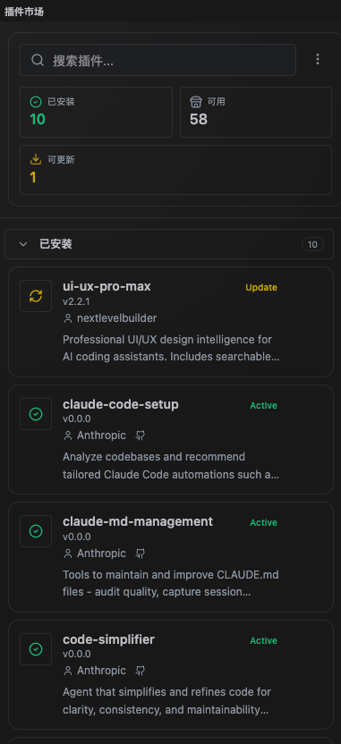
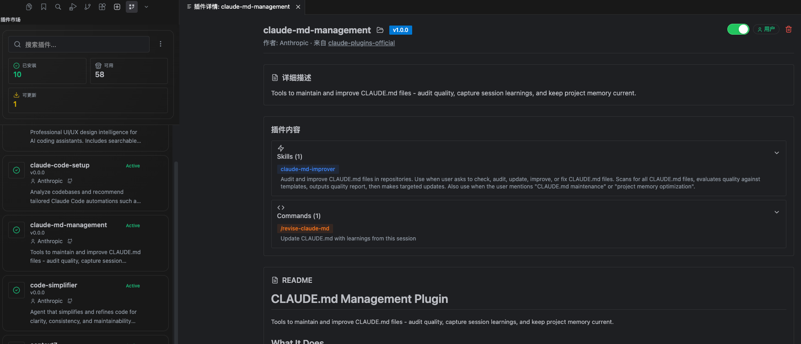
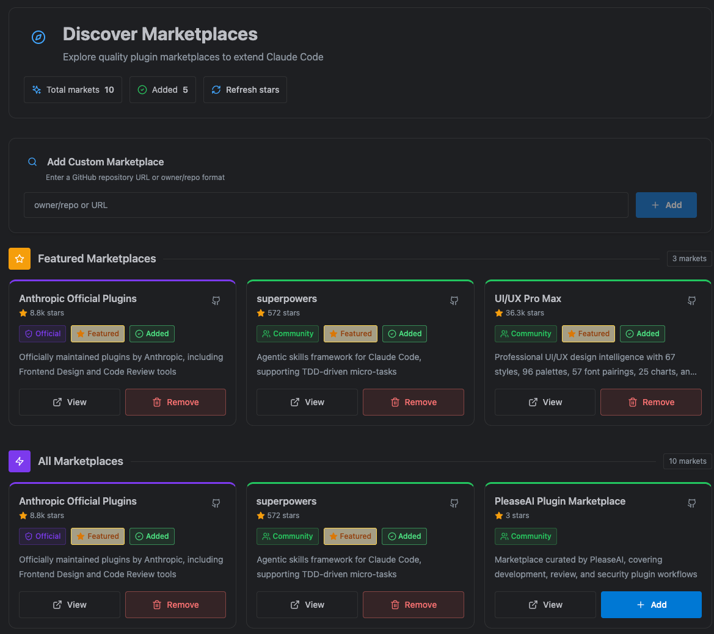

# Claude Plugin Marketplace

A VS Code extension that gives Claude Code users a visual way to discover, install, and manage plugins.

Language: English | [简体中文](./README.zh-CN.md)

## What It Helps You Do

- Browse available plugins in one place
- See what is already installed
- Install, uninstall, enable, disable, and update plugins
- Add and manage plugin marketplaces (official or custom)
- Open plugin details before deciding to install

## Install

Install from the VS Code Marketplace:

1. Open Extensions in VS Code
2. Search for `Claude Plugin Marketplace`
3. Click **Install**

## Quick Start (New Users)

1. Open the **Claude Plugin Marketplace** sidebar view
2. Check the **Installed** section to see your current plugins
3. Browse marketplace sections to find new plugins
4. Click a plugin to open details
5. Install it with one click

## Core Features

### 1. Sidebar Plugin Management

Use the sidebar to quickly scan installed and available plugins, then run common actions.

### 2. Plugin Detail View

Before installing, you can inspect version, description, README, and plugin components (when provided).

### 3. Multi-Marketplace Support

Use official markets and your own custom markets in the same UI.

## Screenshots

## Troubleshooting

### Claude Code CLI not detected

- Confirm Claude Code CLI is installed
- Confirm it is available in your system PATH
- Reload VS Code window and try again

### Plugin install fails

- Check network access
- Confirm the marketplace source is valid
- Retry from the sidebar action menu

### Empty plugin list

- Click refresh in the action menu
- Verify your marketplace is reachable

## FAQ

### Does this extension replace Claude Code CLI?

No. It is a visual management layer on top of Claude Code CLI.

### Can I use private/internal marketplaces?

Yes, as long as the source is accessible from your environment.

---
